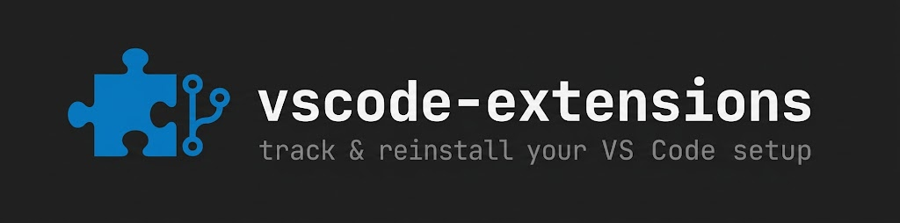

[](https://github.com/kanywst/vscode-extensions/actions/workflows/ci.yml)
[](LICENSE)

_[English](README.md) | 日本語_

VS Code のセットアップ (拡張機能リスト + ユーザー設定) を git で管理し、同じ状態をどのマシンにも再現する。

`extensions.list` が拡張機能ID を、`config/` が `settings.json` / `keybindings.json` / `snippets/` を保持する。`bin/` のスクリプトが両方をエディタから書き出し / インストールし直し / 差分確認する。

## なぜ git 管理のリストなのか

Settings Sync やエクスポートした Profiles でも拡張機能はマシン間で移せる。それでも plain-text のリストを git に置く理由は、それらが埋められない穴を埋めるから。

- **オフライン / エアギャップ / プロビジョニング** — アカウントのサインイン不要。clone して実行するだけ。
- **レビュー可能な基準セット** — 個人クラウドではなく git 履歴と PR に載る。
- **plain text** — `grep` / `diff` / コードレビューがそのまま効く。
- **エディタ非依存** — `CODE_BIN` で `code` / `codium` / `cursor` を同じスクリプトで駆動できる。

管理対象は拡張機能ID に加えて `settings.json` / `keybindings.json` / `snippets/`。clone からマシンを組み直せるだけの範囲を押さえる。Settings Sync の代替ではなく補完。MCP 設定 (`mcp.json`) は意図的に対象外 — そちらは `~/dotclaude` で別管理する。

## 使い方

### 1. このマシンの状態を記録して push する

`extensions.list` には既にこのマシンの拡張機能が入っている。commit して自分の remote へ push する。

```bash
git remote add origin git@github.com:<you>/vscode-extensions.git
git add -A
git commit -m "init: track vscode extensions"
git push -u origin main
```

### 2. 別のマシンで再現する

clone してリストどおりにインストールする。リスト全体を 1 回のエディタ起動でまとめて入れる。再実行は安全で、入っている拡張機能はスキップされる。`bin/install.sh` は `settings.json` / `keybindings.json` / `snippets/` も VS Code の User ディレクトリへ復元する。既存ファイルが異なる場合は先に `<file>.bak` へ退避する。

```bash
git clone git@github.com:<you>/vscode-extensions.git ~/vscode-extensions
cd ~/vscode-extensions
bin/install.sh
```

### 3. 拡張機能や設定を変えたあと

VS Code 上で拡張機能を入れ替えたり設定を変えたら、再書き出しして差分を commit する。`bin/export.sh` はリストと `config/` の両方をスナップショットする。

```bash
bin/export.sh
git add extensions.list config
git commit -m "chore: update extensions and config"
```

`bin/export.sh` は現在の導入済みセットをそのまま鏡写しにするので、拡張機能をリストから**削除 (prune)** する手段でもある。削除せず新規導入分だけ追記したいときは `bin/export.sh --merge` を使う。

### 差分を確認する

インストール済みと `extensions.list` を比較する。差があれば非ゼロで終了するので、CI や pre-commit hook に組み込める。

```bash
bin/diff.sh
```

### リストを lint する

`extensions.list` が canonical 形 (小文字化・ソート・重複排除・余計な行なし) かを検証する。エディタ不要なので CI でも動く。

```bash
bin/lint.sh
```

### 自動でリストを同期する

pre-commit hook を入れると、新しく入れた拡張機能が commit のたびに `extensions.list` へ追記＆ステージされる。

```bash
ln -s ../../bin/pre-commit .git/hooks/pre-commit
```

hook は意図的に `bin/export.sh --merge` を使う。追跡セットの一部しか入っていないマシンで commit しても、新規分を足すだけで既存を**削除しない**ため、基準セットを黙って消す事故が起きない。削除は `bin/export.sh` (フラグなし) で明示的に行う。

## 別エディタを使う場合

Cursor / VSCodium / Insiders など `code` 以外の CLI を使うときは `CODE_BIN` を指定する。

```bash
CODE_BIN=cursor bin/export.sh
CODE_BIN=codium bin/install.sh
```

レジストリの違いに注意。`code` は VS Code Marketplace、Cursor / VSCodium / Windsurf は Open VSX からインストールする。あるエディタで書き出した ID が別のエディタのレジストリには無いことがある (Microsoft 製の一部は Marketplace 専用で、Cursor は別 ID の独自版を持つ)。`bin/install.sh` はそこで中断せず、入れられる分だけ入れて、対象エディタで見つからなかった ID を一覧表示する。

設定の同期は `CODE_USER_DIR` を読み書きする。既定は VS Code 安定版の User ディレクトリ (macOS では `~/Library/Application Support/Code/User`)。別エディタの User ディレクトリを指せば、そのエディタの設定を同期できる。

```bash
CODE_USER_DIR="$HOME/Library/Application Support/Cursor/User" CODE_BIN=cursor bin/export.sh
```

## 注意点

- `code` コマンドが PATH に必要。コマンドパレットの `Shell Command: Install 'code' command in PATH` で追加する。
- 管理対象は拡張機能ID (`publisher.name`) / `settings.json` / `keybindings.json` / `snippets/`。`mcp.json` は対象外 (`~/dotclaude` で管理)、User ディレクトリ外のものも対象外。
- `bin/install.sh` は `code --install-extension --force` を実行するため、導入済みの拡張機能も最新版に更新される。
- `extensions.list` は小文字化・ソート済みで書き出されるので diff が安定する。
- `config/settings.json` はそのままコピーされる。マシン固有の秘密情報が git に混ざらないよう commit 前に中身を確認すること。
