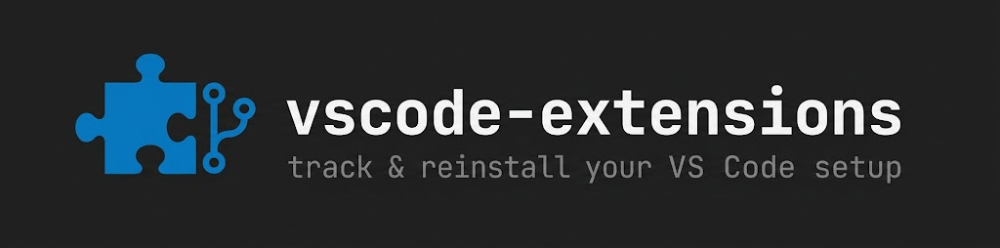

_English | [日本語](README.ja.md)_

Track the VS Code extension list in git and reinstall the same set on any machine.

`extensions.list` holds the extension IDs. The scripts in `bin/` write it from the editor, install from it, and report drift.

## Usage

### 1. Record this machine and push

`extensions.list` already holds the extensions on this machine. Commit it and push to your own remote.

```bash
git remote add origin git@github.com:<you>/vscode-extensions.git
git add -A
git commit -m "init: track vscode extensions"
git push -u origin main
```

### 2. Reproduce on another machine

Clone the repo and install everything in the list. Re-running is safe; installed extensions are skipped.

```bash
git clone git@github.com:<you>/vscode-extensions.git ~/vscode-extensions
cd ~/vscode-extensions
bin/install.sh
```

### 3. After adding or removing an extension

When you install or uninstall something in VS Code, re-export and commit the diff.

```bash
bin/export.sh
git add extensions.list
git commit -m "chore: update extensions"
```

### Check for drift

Compare the installed extensions against `extensions.list`. Exits non-zero when they differ, so it fits a CI step or pre-commit hook.

```bash
bin/diff.sh
```

### Keep the list in sync automatically

Install the pre-commit hook so `extensions.list` is re-exported and staged on every commit. The list never drifts behind what you actually have installed.

```bash
ln -s ../../bin/pre-commit .git/hooks/pre-commit
```

## Using another editor

For a CLI other than `code` (Cursor, VSCodium, Insiders), set `CODE_BIN`.

```bash
CODE_BIN=cursor bin/export.sh
CODE_BIN=codium bin/install.sh
```

## Notes

- The `code` command must be on `PATH`. Add it from the Command Palette: `Shell Command: Install 'code' command in PATH`.
- Only extension IDs (`publisher.name`) are tracked, not `settings.json` or keybindings.
- `bin/install.sh` runs `code --install-extension --force`, which also updates an already-installed extension to the latest version.
- `extensions.list` is written lowercased and sorted so diffs stay clean.
